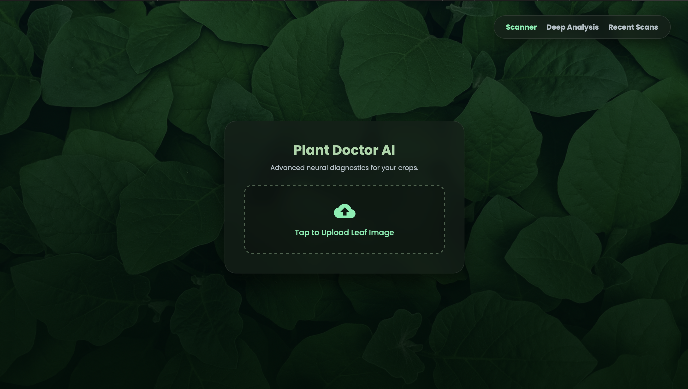

# 🌿 Plant Disease Detection & Explainable AI (XAI)

A full-stack web application designed to identify plant diseases from images using deep learning, featuring Explainable AI (XAI) to visually demonstrate how the model makes its decisions.

## 🚀 Features
- **Accurate Classification:** Utilizes a 38-class convolutional neural network (MobileNetV2) trained on the Plant Village dataset for robust disease identification.
- **Explainable AI (Grad-CAM):** Implements custom TensorFlow gradient-extraction logic to generate Grad-CAM heatmaps, highlighting the exact diseased areas the model focused on.
- **Responsive UI:** Features a custom "glassmorphism" frontend built with HTML, CSS, and asynchronous JavaScript for a seamless user experience.
- **Session Tracking:** Includes a session-based memory database to securely track diagnostic history during use.

## 🛠️ Tech Stack
- **Backend:** Python, Flask
- **Machine Learning:** TensorFlow, Keras, MobileNetV2
- **Frontend:** HTML, CSS, JavaScript

## 📸 Sneak Peek
### Web Interface

## ⚙️ How to Run Locally
1. Clone this repository: `git clone https://github.com/YourUsername/Plant-Disease-Detection-XAI.git`
2. Install the required dependencies (ensure you have TensorFlow and Flask installed).
3. Run the Flask application: `python app.py`
4. Open your browser and navigate to `http://localhost:5000`
